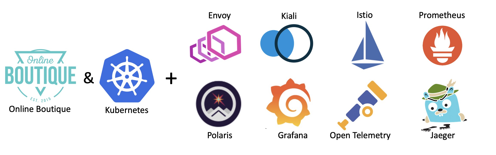
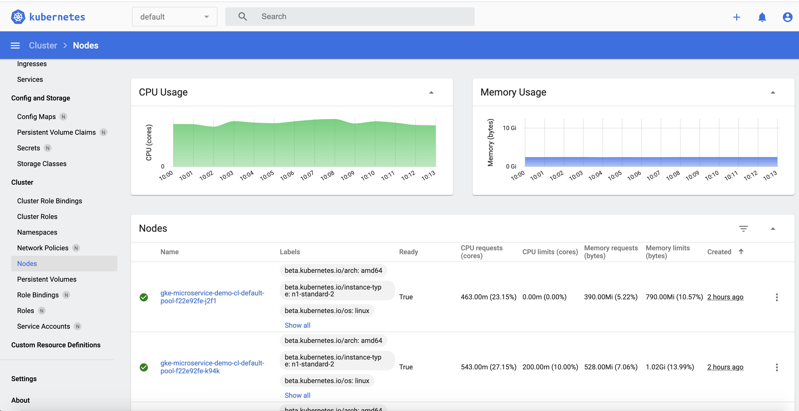
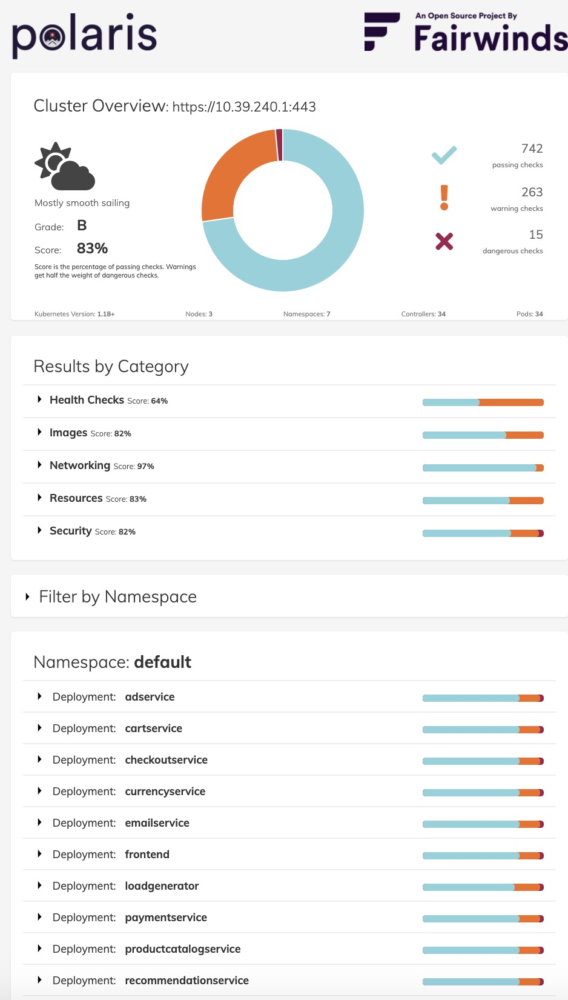
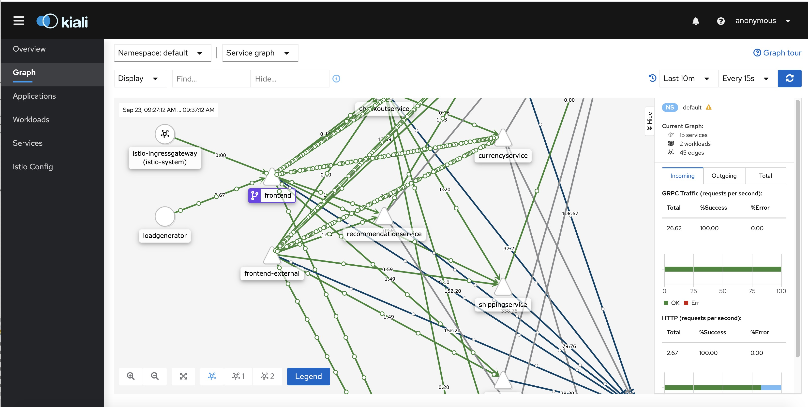
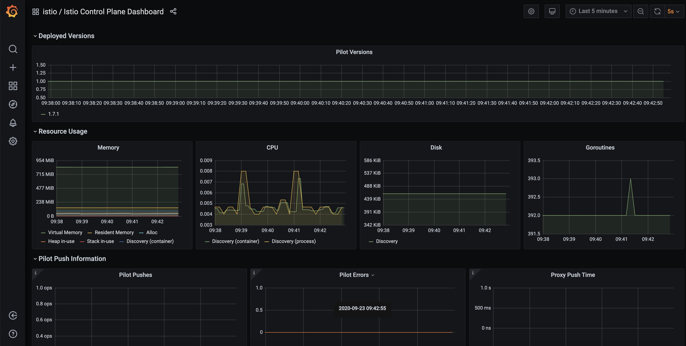
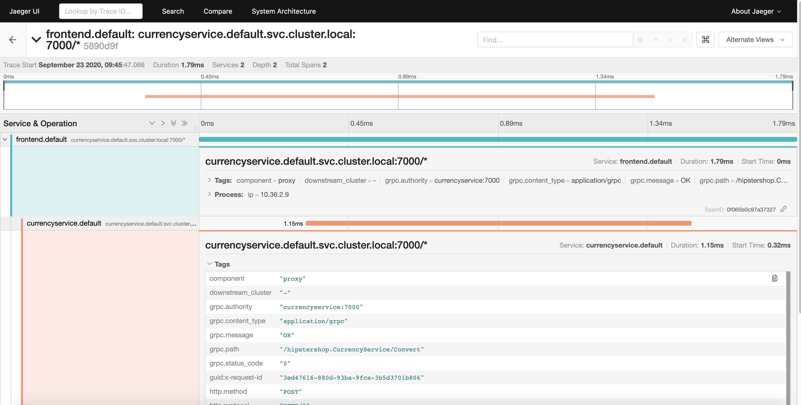
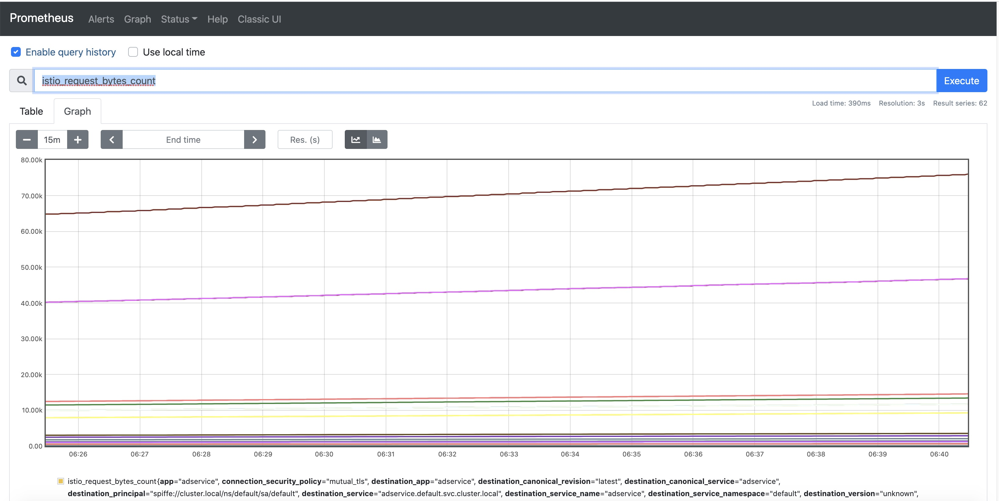
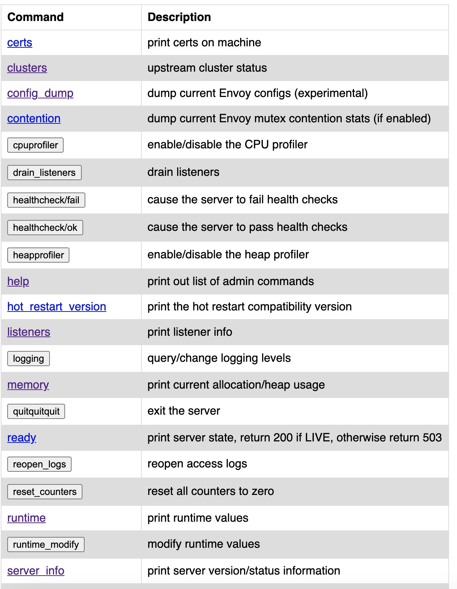

# Microservices on cloud-based Kubernetes


[](https://opensource.org/licenses/Apache-2.0)

The purpose of this repository is to provide the fully automated setup of a nice-looking (see [screenshots](https://github.com/GoogleCloudPlatform/microservices-demo#screenshots)) 
showcase / testbed for a cloud-native ([precisely defined](https://docs.microsoft.com/en-us/dotnet/architecture/cloud-native/definition) application
by Microsoft) on a cloud-hosted Kubernetes cluster (here [GKE by Google Cloud](https://cloud.google.com/kubernetes-engine)) based on an interesting [service mesh](https://www.redhat.com/en/topics/microservices/what-is-a-service-mesh). 
So, additionally, the setup will install tooling (coming from the [CNCF Cloud Trail Map](https://github.com/cncf/trailmap) for many of them) to make the application and its service mesh observable and manageable.

This application, licensed under Apache terms (same terms for all components used in this worklfow - So, allowing free reuse) is the ["Online Boutique"](https://github.com/GoogleCloudPlatform/microservices-demo)
 (formerly known as Hispter Shop - developed by a Google team but not an official product of them). It is composed of 10 polyglot microservices behind a nice-looking web frontend calling them to serve client requests. 
 A load-generator - part of the package - will generate traffic while the application is running to make use of tools (Prometheus, OpenTelemetry, 
 etc.) more attractive.

Another goal of this repository is to help people exploring the cloud-native architecture: when you fork it, you rapidly get a working cluster with a somewhat 
"real-life" application and decent tooling to experiment with, without the need for a long trial-and-error process starting with infrastructure to set it 
up from scratch. It makes it much faster to grasp the philosophy of the distributed architecture proposed by Kubernetes.

So, happy forking for your own use! (see [Setup section](#setup-for-forks) for all 
technical details) And come back regularly or get notified by following this repository: we will add additional tools in subsequent updates.

We implement here a Github workflow ([microservices-on-gke.yml](.github/workflows/microservices-on-gke.yml) & [shells in sh directory](sh/)
- see our [other repository](https://github.com/didier-durand/gcp-workflows-on-github) for other workflows)
which allows to automatically deploy a fresh cluster on GKE and to deploy the application on it whenever needed via a [single click](https://github.blog/changelog/2020-07-06-github-actions-manual-triggers-with-workflow_dispatch/). 
On our side, this same workflow is also started automatically on a recurring basis (at least weekly) via Github's cron facility (included in workflow yaml) 
to make sure that the deployment remains fully operational as underlying GKE infrastructure and implemented components evolve. You can access logs 
of previous runs in the [Actions Tab](actions/).

## Access to application & load generator

On successful completion of the workflow, the Online Boutique is accessible from anywhere on the Internet at the public IP address 
(dynamically created and published by GKE) displayed in the final lines of workflow execution step "Deploy application on GKE". Indeed, it is the IP 
address of the [K8s service](https://kubernetes.io/docs/concepts/services-networking/service/) 'frontend-external' defined by the deployment. Hence, 
you can also get it at any time via *'kubectl get service 'frontend-external''* provided that you went through proper setup as described below.

To check the activity of the load generator, you can at any time run *'kubectl logs -l app=loadgenerator -c main'*
You should get something like the following describing how many requests were already triggered:

```
kubectl logs -l app=loadgenerator -c main
 GET /product/66VCHSJNUP                                          600     0(0.00%)      77      34    1048  |      41    0.10    0.00
 GET /product/6E92ZMYYFZ                                          563     0(0.00%)      77      34    1763  |      41    0.00    0.00
 GET /product/9SIQT8TOJO                                          593     0(0.00%)      73      34    1013  |      41    0.30    0.00
 GET /product/L9ECAV7KIM                                          631     0(0.00%)      82      34    1349  |      42    0.20    0.00
 GET /product/LS4PSXUNUM                                          608     0(0.00%)      83      34     896  |      42    0.20    0.00
 GET /product/OLJCESPC7Z                                          623     0(0.00%)      69      34    1079  |      41    0.10    0.00
 POST /setCurrency                                                808     0(0.00%)      82      44    1089  |      51    0.20    0.00
--------------------------------------------------------------------------------------------------------------------------------------------
 Aggregated                                                      9517     0(0.00%)                                       1.80    0.00
```
 
If you want to easily inject more traffic, you can additionally use the [hey](https://github.com/rakyll/hey) or [fortio](https://github.com/fortio/fortio) 
utilities as we did in our [Knative project](https://github.com/didier-durand/knative-on-cloud-kubernetes) : see correponding [workflow script](https://github.com/didier-durand/knative-on-cloud-kubernetes/blob/master/.github/workflows/gcloud-gke-knative.yml).

## Access to deployed tools & dashboards

You have first to implement the requirements of the [Setup section](https://github.com/didier-durand/microservices-on-cloud-kubernetes) 
before trying to access the dashboards.

To keep things simple, we access all tools and dashboards via the proxy functions available in Kubernetes: either directly via *'kubectl proxy'* 
or indirectly via *'istioctl dashboard'*. Only limited additional definitions are then required: it's just fine for a demo and initial tests. 
Of course, the laptop running the proxies must be authentified to gcloud via SDK with proper credentials giving rights to cluster administration.

__**Available dashboards:**__

(click on pictures to enlarge them - also use the hyperlinks provided with each dashboard description to have a good overview of the 
features of each tool from its official documentation)



1. **Standard K8s UI**: our workflow deploys first [this standard Kubernetes dashboard](https://kubernetes.io/docs/tasks/access-application-cluster/web-ui-dashboard/) 
as a tool that should anyway be included in any installation. It gives a good overview of the deployed cluster with static (configuration) and dynamic (metrics) information 
about the active objects. When *'kubectl proxy'* is active, the dashboard is available at [this url](http://localhost:8001/api/v1/namespaces/kubernetes-dashboard/services/https:kubernetes-dashboard:/proxy/). 
The security check at login is most easily satisfied by selection the login option of config file (see Prereqs to obtain it in Setup section). 



2. **Polaris dashboard**: [Polaris](https://github.com/FairwindsOps/polaris) is an interesting tool, even in its OSS version (the paid-for version 
provides more checks) used here. After installation, it [scans the definitions](https://www.fairwinds.com/polaris) of various kinds of objects and applies sanity checking rules to 
validate their proper configuration. For example, in the case of Online Boutique, it will warn that containers have no resource constraints (cpu, 
memory, etc.) imposed on them or that their security credentials are too wide compared to what they do. The hyperlinks provided on the unsatisfactory 
checks document the reason(s) of the alert as well as the possible remedies to apply. So, a quite useful tool to incrementally increase the quality of the 
configuration of a given cluster: new versions of yaml object manifests can be gradually deployed to minimize the issue notifications.



3. **Kiali Dashboard**: [Kiali](https://kiali.io/) claims itself the *"Service mesh management for Istio"*. it allows an interactive discovery of 
 the defined relations between the services. Then, it provides [detailed insights and metrics](https://kiali.io/documentation/latest/features/) about the 
 health of those services and the requests between them.  The live traffic animation in the UI is extremely useful: it allows to spot very quickly 
 where the activity happens to focus on those hot spots during root cause analysis for an issue. You can also go back in time with the replay 
 feature to see the traffic and the interactions that happened in the past to understand why and how you reached current situation. This dashboard 
 is accessed via *'istioctl dashboard kiali'* that will open the corresponding UI into your web browser.



4. **Grafana dashboard**: [Grafana](https://grafana.com/oss/grafana/) which *'allows you to query, visualize, alert on metrics and logs, no 
 matter where they are stored'* provides very nice charts about the activity of the cluster as the whole (usual metrics about resource consumption: 
 cpu, memory, etc. for nodes. But, more specifically in this context it provides interesting additional [dashboards specific to the Istio service mesh](https://istio.io/latest/docs/tasks/observability/metrics/using-istio-dashboard/) 
 related to the traffic between the pods. Those dashboards are accessed via *'istioctl dashboard grafana'* that will open the corresponding UI into 
 your web browser.



5. **Jaeger dashboard**: the Open Boutique is instrumented via [OpenCensus](https://opencensus.io/), now merged into 
[OpenTelemetry](https://opentelemetry.io/), component of the CNCF Cloud Trail Map. Jaeger - in CNCF Cloud Trail Map - is the tracing backend 
implemented here. It centralizes and ingests the distributed traces produced by the various microservices. So, the Jaeger dashboard will allow the 
detailed examination of those aggregated distributed traces also known as ["spans"](https://opentracing.io/docs/overview/spans/#what-is-a-span). This 
dashboard is accessed via *'istioctl dashboard jaeger'* that will open the corresponding UI into your web browser.
 

 
6. **Prometheus dashboard**: [Prometheus](https://prometheus.io/) (also member of CNCF Cloud Trail Map) is the cornerstone component for metrics 
collection. The collected data is used by Grafana, Kiali & Jaeger for their specific purposes. The Prometheus dashboard can be used as the "source 
of truth": for example, it can be used to verify if some metrics claimed as missing by a downstream component using this value is really collected 
or not and to compare the graph produced by Prometheus itself to the graph produced downstream user to spot potential discrepancies. This dashboard 
is accessed via *'istioctl dashboard prometheus'* that will open the corresponding UI into your web browser.



7. **Envoy dashboard**: an improved version of [Envoy Proxy](https://www.envoyproxy.io/docs/envoy/latest/intro/what_is_envoy), also part of the CNCF Cloud Trail Map,  is the [sidecar
  container](https://istio.io/latest/docs/concepts/what-is-istio/) used by Istio. Envoy provides a (somewhat rough) dashboard to go into the 
  nitty-gritty details of a given pod: it is usually used for low-level introspection into the traffic between pods in unexpected situations. It is 
  more a debugging tool at very low-level: most cluster administrators shouldn't need to use it. This dashboard is accessed via *'istioctl 
  dashboard envoy podname[.namespace]'*: it will open the corresponding UI for the chosen pod sidecar into your web browser.
   
## Workflow steps

The workflow has following steps:

1. setup of workflow parameters via environment variables
2. checkout of project artefacts
3. Setup of gcloud SDK for authentication to Google Cloud through secrets defined in repository via setup.(subsequent steps in shell script)
5. create cluster
6, import cluster config & credentials for kubectl & istioctl
7. deploy standard K8s dashboard and check its proper deployment
8. deploy Polaris dashboard and check its proper deployment
9. deploy Istio and check its proper deployment
10. deploy Istio-based addons and check their proper deployment
11. label application namespace to ensure automatic sidecar injection (see [Istio architecture](https://istio.io/latest/docs/ops/deployment/architecture/) uses an improved version of Envoy for sidecars) in microservice pods
12. deploy proper application manifests for Istio
13. deploy Online Boutique and check its proper deployment
14. obtain application public IP address and check accessibility from GitHub CI/CD
15. validate expected activity of the traffic generator for Online Boutique
16. check proper service mesh config for the microservices via istioctl

Application can now be accessed as described [above](https://github.com/didier-durand/microservices-on-cloud-kubernetes#access-to-application--load-generator)


## Application features & service mesh

<p align="center"></p>
<p align="center"><ins>application service mesh<ins></p>


This demo application contains an interesting service mesh to give some substance to demos and tests: its schema is given above. This mesh 
which is thoroughly used by a traffic generator - also part of the demo package - which generates constant solid traffic to make the implementation 
of monitoring tools.

Interesting points of Online Boutique:

1. **Multi-language:** the microservices corresponding to the various application features were on purpose written on purpose by the authors in 
numerous languages (Go, NodeJS, Java, C#, Python) to demonstrate a key strength of container-based applications: many microservices collaborate in 
a "polyglot" environment where each team (or individual) can program in its language of choice while ad hoc frameworks for each language make sure 
that all Kubernetes standards (probes, etc.) and architecture can be easily respected with minimal effort to obtain a coherent and compliant global 
system, manageable by the standard palette of Kubernetes tools. This polyglot aspect is reinforced by the mixed use of http and gRpc, which are both
 understood by the monitoring tools.
 
2. **Service Mesh:** the application graph shows relationships between the various services and the front-end. Indeed, the application 
is made of13 pods. This high-level of granularity is the accepted Kubernetes pattern for application architecture: it brings numerous advantages like continuous 
delivery, exhaustive unit testing, higher resilience, optimal scalability, etc. But, it also requires the use of a thorough set of tools to 
maximize the observability of the system. If "divide and conquer" is the motto of cloud-native architectures, the motto of their operations is probably 
"observe to sustain": when working with Kubernetes application, one feels very quickly the need for (very) solid tools monitoring automatically 
the myriad of objects (services, pods, ingress, volumes, etc.) composing the system.   

3. **GCP Tooling:** the application is instrumented for [Stackdriver (profiling, logging, debugging)](https://en.wikipedia.org/wiki/Stackdriver). So, 
the source code of this application provides the right guidance to see how to code in order to obtain the right leverage on tools directly available 
from the GCP service portfolio.

## Setup for forks

To start with, you need a Google Cloud account with a project in it where the GKE APIs have been enabled. Obtain the id of your project from 
GCP dashboard. Additionally, you need to create in this project a service account and give it proper GKE credentials: right to create, administer 
and delete a cluster. Save its private key in json format.

Then, fork our repository and define the required [Github Secrets](https://docs.github.com/en/actions/reference/encrypted-secrets) in your forked 
repository: 
1. your GCP project id will be {{ secrets.GCP_PROJECT }}
2. The private key of your service account in json format will be ${{ secrets.GCP_SA_KEY }} 

To easily launch the workflow, you can launch it with the [manual dispatch feature of Github](https://github.blog/changelog/2020-07-06-github-actions-manual-triggers-with-workflow_dispatch/) that you can see as a launch button in the Action tab of your project for 
the "Deploy Online Boutique" workflow. Similarly, you can stop it via similar button in "Terminate Online Boutique" workflow.

When the deployment workflow completes successfully, you should be able to access the Online Boutique from anywhere on the Internet at the pubic IP 
address displayed in the final lines of step "Deploy application on GKE" (or via 

To get access to the cluster via kubectl and to the dashboards via istioctl, you need to install on your machine the gcloud SDK, connect to GCP 
with your userid (having at least same credentials as service account above). Then, use *'gcloud container clusters get-credentials <CLUSTER-NAME> --zone <GCP-ZONE> --project=<PROJECT-ID>'* 
with your own values. It will prepare and install on your machine the proper config and credentials files - usually located in ~/.kube - to give 
you access to your cluster via kubectl and istioctl.

Finally, you should [install kubectl](https://kubernetes.io/docs/tasks/tools/install-kubectl/) and 
[install istioctl](https://istio.io/latest/docs/setup/install/istioctl/) if not present on your laptop yet.

